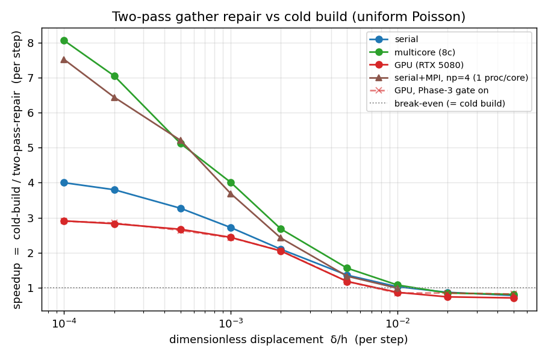
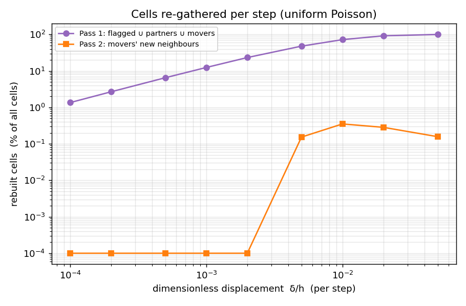
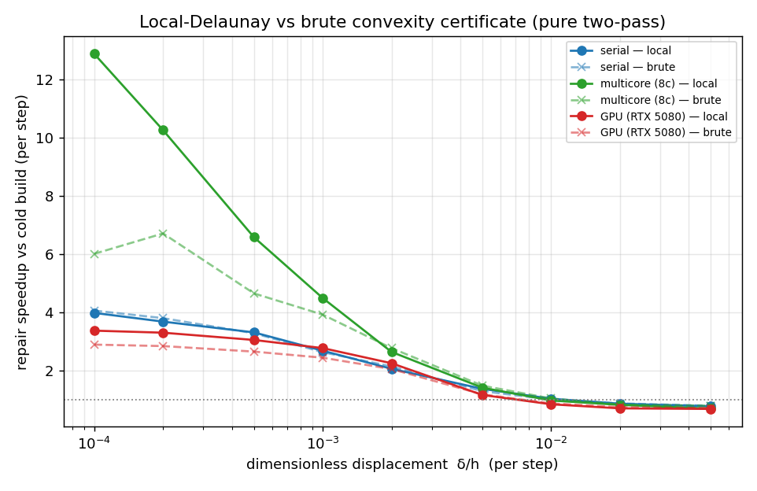

# Two-pass gather repair vs cold build — displacement sweep across devices (2026-06-29)

A focused benchmark of the implemented two-pass gather repair (`MovingTessellation::step`,
`include/vorflow/device/repair.hpp`) as a function of the **dimensionless per-step displacement
δ/h** (h = mean inter-seed spacing), starting at very small displacement where almost no cell is
invalidated. Goal: the speedup that is actually achievable, and how many cells each pass re-gathers.

**Workload.** Periodic uniform-Poisson point set, ballistic motion: every seed advances by `δ` per
step along a fixed random velocity. Each step the tessellation is updated and compared to a fresh cold
build (the production `buildTessellation`, which is also the oracle). FP64. Reproduce with
`tests/kokkos/bench_dynamic_update --repair` (env `VORF_DISPS`, `VORF_NOGATE`, `VORF_TOL`); distributed
with `tests/kokkos_mpi/bench_repair_mpi` under `mpirun`.

**Devices.** serial (Kokkos Serial), multicore CPU (OpenMP, 8 threads), GPU (CUDA, RTX 5080), and
serial+MPI (one process per core, Serial backend). Single-domain N: GPU 2·10⁵, multicore 10⁵, serial
3·10⁴; MPI N=6·10⁴ global. Tables/graphs below are the **pure two-pass** path (Phase-3 gate off) so
the full curve and the per-pass fractions are visible; the production curve (gate on) is shown dashed.

> **Measured-here optimization.** Profiling this sweep showed the small-δ/h speedup was pinned by the
> verify pass doing a *second* full re-eval over all N cells. That is redundant: after the gathers,
> every non-gathered cell's re-eval is bit-identical to the Pass-1 certify (same stored topology, same
> neighbour positions), and every *gained* edge has both endpoints gathered (a flip's partners in
> Pass 1, a mover's new neighbours in Pass 2). So the verify now re-certifies **only the gathered
> cells** (`certifyList`) — provably equivalent, and it lifted the GPU near-zero-churn speedup from
> 2.2× to 2.9× (and more on CPU). Plus a `n1==0` fast path: when the certificate flags nothing, the
> tessellation is already Voronoi on the new positions, so the step publishes after one re-eval with
> no gather and no verify. Both are exactness-preserving (all gates + exact-vs-oracle still PASS).

## Speedup vs displacement



## Cells re-gathered per step (Pass 1 / Pass 2)



The Pass-1 and Pass-2 fractions are a property of the *geometry* (the certificate + the displacement),
not the device — they are within ~0.05 pp across all backends, so one curve suffices.

| δ/h | Pass-1 rebuilt (% of cells) | Pass-2 rebuilt (% of cells) | genuinely-changed cells (% , vs oracle) |
|---|---|---|---|
| 0.0001 | 1.35 | ~0 | ~0.14 |
| 0.0002 | 2.67 | ~0 | ~0.14 |
| 0.0005 | 6.49 | ~0 | ~0.14 |
| 0.0010 | 12.4 | ~0 | ~0.14 |
| 0.0020 | 23.2 | ~0 | ~0.11 |
| 0.0050 | 47.7 | 0.15 | ~0.07 |
| 0.0100 | 71.8 | 0.35 | ~0.03 |
| 0.0200 | 91.5 | 0.28 | ~0.006 |
| 0.0500 | 99.8 | 0.16 | ~0 |

Two things to read from this:

- **Pass 2 is ≈ 0 for smooth motion.** Pass 2 re-gathers the *new neighbours of skin-movers* — the
  insertion side. Under ballistic motion no seed moves more than skin/2 within the run, so essentially
  nothing routes to Pass 2; the two-pass collapses to a single gather pass. Pass 2 earns its keep only
  for genuine insertions: in the far-jump stress test (teleport ~1 % of seeds) Pass 2 rebuilds the
  teleporters' new neighbours and the result stays exact (`missedNbr=0`).
- **The certificate over-flags ~10×.** At δ/h=0.0001 only ~0.14 % of cells actually change their
  neighbour set, but Pass 1 re-gathers 1.35 % — the convexity certificate is deliberately conservative
  (a vertex poking a stored plane by > tol flags the cell, and cumulative drift trips marginal faces).
  This 5–10× over-flag is the dominant lever for further speedup (tighter detection / a tighter flag
  set) and is the Phase-3 tuning target; the verify net keeps it exact regardless.

## Per-device tables (pure two-pass, gate off)

### serial (Kokkos Serial, N=3·10⁴)
| δ/h | cold ms | repair ms | speedup | Pass-1 % | Pass-2 % |
|---|---|---|---|---|---|
| 0.0001 | 523.7 | 131.0 | **4.00×** | 1.41 | 0.000 |
| 0.0002 | 516.8 | 136.0 | 3.80× | 2.69 | 0.000 |
| 0.0005 | 511.9 | 156.8 | 3.27× | 6.55 | 0.000 |
| 0.0010 | 513.9 | 188.6 | 2.72× | 12.7 | 0.000 |
| 0.0020 | 511.6 | 243.6 | 2.10× | 23.2 | 0.000 |
| 0.0050 | 504.6 | 369.9 | 1.36× | 47.7 | 0.005 |
| 0.0100 | 509.9 | 494.0 | 1.03× | 72.1 | 0.189 |
| 0.0200 | 511.6 | 585.8 | 0.87× | 91.7 | 0.204 |
| 0.0500 | 500.5 | 639.9 | 0.78× | 99.8 | 0.131 |

### multicore CPU (OpenMP 8 threads, N=10⁵)
| δ/h | cold ms | repair ms | speedup | Pass-1 % | Pass-2 % |
|---|---|---|---|---|---|
| 0.0001 | 262.6 | 32.6 | **8.06×** | 1.37 | 0.000 |
| 0.0002 | 255.2 | 36.2 | 7.05× | 2.67 | 0.000 |
| 0.0005 | 256.7 | 50.1 | 5.12× | 6.58 | 0.000 |
| 0.0010 | 251.7 | 62.7 | 4.01× | 12.6 | 0.000 |
| 0.0020 | 253.1 | 94.3 | 2.68× | 23.4 | 0.000 |
| 0.0050 | 240.1 | 154.0 | 1.56× | 47.9 | 0.108 |
| 0.0100 | 243.3 | 226.3 | 1.08× | 72.2 | 0.292 |
| 0.0200 | 248.9 | 294.1 | 0.85× | 91.8 | 0.245 |
| 0.0500 | 253.4 | 314.5 | 0.81× | 99.8 | 0.133 |

### GPU (CUDA, RTX 5080, N=2·10⁵)
| δ/h | cold ms | repair ms | speedup | Pass-1 % | Pass-2 % |
|---|---|---|---|---|---|
| 0.0001 | 63.1 | 21.6 | **2.91×** | 1.35 | 0.000 |
| 0.0002 | 62.9 | 22.2 | 2.83× | 2.67 | 0.000 |
| 0.0005 | 62.9 | 23.5 | 2.67× | 6.49 | 0.000 |
| 0.0010 | 62.7 | 25.7 | 2.44× | 12.4 | 0.000 |
| 0.0020 | 62.9 | 30.7 | 2.05× | 23.2 | 0.000 |
| 0.0050 | 63.3 | 53.7 | 1.18× | 47.7 | 0.153 |
| 0.0100 | 62.9 | 72.1 | 0.87× | 71.8 | 0.351 |
| 0.0200 | 63.1 | 85.8 | 0.74× | 91.5 | 0.283 |
| 0.0500 | 62.7 | 88.9 | 0.71× | 99.8 | 0.157 |

### serial + MPI, one process per core (N=6·10⁴ global; speedup is per-step, aggregate)
| δ/h | np=1 | np=2 | np=4 |
|---|---|---|---|
| 0.0001 | 7.30× | 7.05× | 7.52× |
| 0.0002 | 6.54× | 6.49× | 6.44× |
| 0.0005 | 5.10× | 4.97× | 5.21× |
| 0.0010 | 3.77× | 3.74× | 3.69× |
| 0.0020 | 1.89× | 2.54× | 2.42× |
| 0.0050 | 1.52× | 1.36× | 1.33× |
| 0.0100 | 0.92× | 0.91× | 0.99× |

(Both the distributed cold build and the distributed repair scale ~1/np — cold 1029→539→273 ms,
repair 141→76→36 ms at np=1→2→4 — so the per-rank speedup is preserved under domain decomposition; the
MPI halo exchange is common to both paths and is not the bottleneck at these sizes. `regath%` rises at
δ/h ≥ 0.005 as Verlet-skin trips force a re-gather of the owned block.)

## What the numbers say

1. **At very small displacement the speedup is large and device-dependent, set by the ratio
   `cold-build / re-eval-floor`.** When almost no cell is invalidated, the per-step cost collapses to
   (grid build + one re-eval of every cell + a tiny gather). That floor is *irreducible* — every
   cell's geometry must be recomputed because its neighbours moved — so the ceiling is how much more
   expensive the cold build's gather+clip is than that floor:
   - **multicore CPU: ~8×**, **serial+MPI: ~7.5×**, **serial: ~4×**, **GPU: ~2.9×**.
   The CPU paths win biggest because the clip-bound cold build is far more expensive than the re-eval;
   the GPU's cold build is already fast (clip-bound but latency-hidden), so the re-eval floor is a
   larger fraction and the ceiling is lower. Multicore beats serial because the repair's re-eval
   (compute-bound) thread-scales better than the cold build's memory-latency-bound gather (cold 8-thread
   speedup ≈ 2×, repair ≈ 4×), so on more cores the repair pulls further ahead.
2. **The crossover (repair = rebuild) is near δ/h ≈ 0.01 on the CPU paths and ≈ 0.005 on GPU.** Beyond
   it the certificate flags the majority of cells (Pass-1 → 70–100 %) and re-clipping them costs as
   much as a rebuild. This is exactly where the production **Phase-3 gate** routes the step to a full
   rebuild (dashed line: GPU gate-on flattens at ~0.85× — one re-eval of overhead — instead of falling
   to 0.71×), so the production updater is never much slower than a rebuild while keeping the 2–8× win
   in the small-displacement regime that real CFD/DEM time-stepping lives in.
3. **Two passes, but effectively one for smooth motion.** Pass 1 (flagged ∪ violated-plane partners ∪
   skin-movers) does all the work; Pass 2 (movers' new neighbours) is ~0 unless there are genuine
   insertions (far jumps), where it is exactly what keeps the result correct.
4. **Exactness holds throughout** (gate `missedNbr=0`/machine-volume at `VORF_TOL=1e-7`; the
   default-tol `maxRelV ~ 1e-4` is the certificate-tolerance accuracy, not error). The far-jump
   teleport stays exact via Pass 2.

## Cheapening the certificate: the local-Delaunay test

The sweep above showed the per-step floor at small δ/h is the **convexity certificate**
(`isSelfConsistent`), not the geometry re-eval — a flop count confirms the brute test (every live
vertex vs every plane, O(nt·np) ≈ 540 dot-products/cell) is several× the re-eval. So we replaced it with
a **local-Delaunay test**: a Voronoi vertex `v=(a,b,c)` is the circumcenter of the Delaunay tet
`(i,a,b,c)`; by Delaunay's lemma it can only be poked across one of that tet's **four faces**, so each
vertex is tested against just **four "poke" planes** (the three in-seed faces = the edge-opposite
planes, plus the fourth face `(a,b,c)` = the nearest non-defining plane at the build config). The poke
planes are stored per dual-triangle in the `TopologyStore` (computed once per (re)build/gather; pure
topology + the cached vertex), so the per-step cost drops from O(nt·np) to O(nt·4).

`GATE 2` validates it flags the **same cells** as the brute test: identical at the operating regime
(0 mismatches at δ/h ≤ 0.001), with a handful per 10⁴ as δ/h grows (the build-config 4th-face goes
stale) — and the Phase-3 gate rebuilds that regime anyway. The repair's exactness gate stays green
(machine-exact at `VORF_TOL=1e-7`). It is maintained adaptively: a gate-rebuild keeps the brute test for
one step (no poke cost in a high-churn regime), and a low-churn streak builds the poke once and then
maintains it incrementally, so the local path is never slower than brute.



| device | δ/h=0.0001 brute → local | speedup of the repair |
|---|---|---|
| **multicore (8c)** | 6.0× → **12.9×** | **2.1×** |
| **GPU (RTX 5080)** | 2.9× → **3.4×** | 1.17× |
| **serial** | 4.1× → 4.0× | ~1.0× (neutral) |

The win is biggest on **multicore**, where the brute scan's scattered plane-memory access is
bandwidth-bound across threads and the 4-plane test relieves it; **moderate on GPU** (fewer per-thread
iterations); and **neutral on serial**, where a single thread is dominated by the cell load + re-eval
rather than the convexity scan. (The graph is the pure two-pass / gate-off path, so its large-δ/h tail
shows the poke-maintenance overhead; with the production gate on, that regime rebuilds and the local and
brute curves coincide there.) `VORF_BRUTECERT=1` forces the brute test for A/B.

## Reducing the over-flag: inline reshape repair

The certificate flags ~10× more cells than actually change their neighbour set; the extra ones are
**reshapes** — a vertex has drifted past an *already-existing* face-plane (accumulated drift, or a flip's
common-neighbours), so the cell's neighbour SET is unchanged and only its triangulation reshaped. A
flagged cell that is **not a partner and not a skin-mover cannot have gained an external neighbour** (a
gain always arrives as a partner or a mover), so its true cell is just the re-clip of its **stored**
neighbour planes — repair it in place, no grid gather (`reshapeRepair`). Measured: **~half of all flagged
cells are reshapes** (the `gath%`/`reshp%` columns split roughly evenly), so the Pass-1 gather load
halves.

The catch is the same gain-invisibility wall as Phase 4: a flagged cell *can* also harbour a sub-tol gain
whose partner-report fell under tol, and stored-plane re-clip misses it (the grid gather would not). That
miss is negligible at small per-step displacement and grows with it, so the inline path is gated to a
churn **window** (`[0.02, 0.25]`) where it is exact to the gather (identical `maxRelV`); outside it every
flagged cell takes the exact gather. It is also **per-backend by default** — on for the CPU paths (the
halved gather is memory-bound across threads, so it pays), **off on GPU** (the extra kernel launches cost
more than the cheap gather they replace). Gates + repair exactness stay green; `VORF_INLINE=1` /
`VORF_NOINLINE=1` force it.

Net: on host it shaves the gather work in the δ/h ≈ 5·10⁻⁴–3·10⁻³ band (~+10% in a longer run, though
noise-sensitive since the Pass-1 gather is not the dominant small-δ/h cost — the full-N certify is). It is
a safe, exactness-preserving reduction of the over-flag *cost*; the over-flag *count* is unchanged, and
the honest finding is that reducing it is a modest lever on this engine because the gather it targets is
not the small-displacement bottleneck.

## Reproduce

```
# single-domain, pure two-pass, fine sweep from very small δ/h:
VORF_NOGATE=1 ./build_<backend>/tests/kokkos/bench_dynamic_update <N> <nSteps> --repair
# production (gate on): drop VORF_NOGATE.  Custom sweep: VORF_DISPS="1e-4 2e-4 ... 5e-2".
# distributed (one process per core):
OMP_NUM_THREADS=1 mpirun -np <R> ./build_kmpi/bench_repair_mpi <Nglobal> <nSteps>
```
Graphs: `python3 plot_sweep.py <results_dir> docs/figs` (script in the scratch dir).
