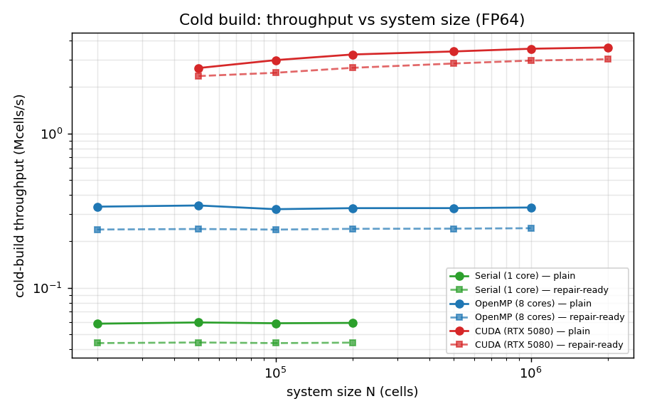
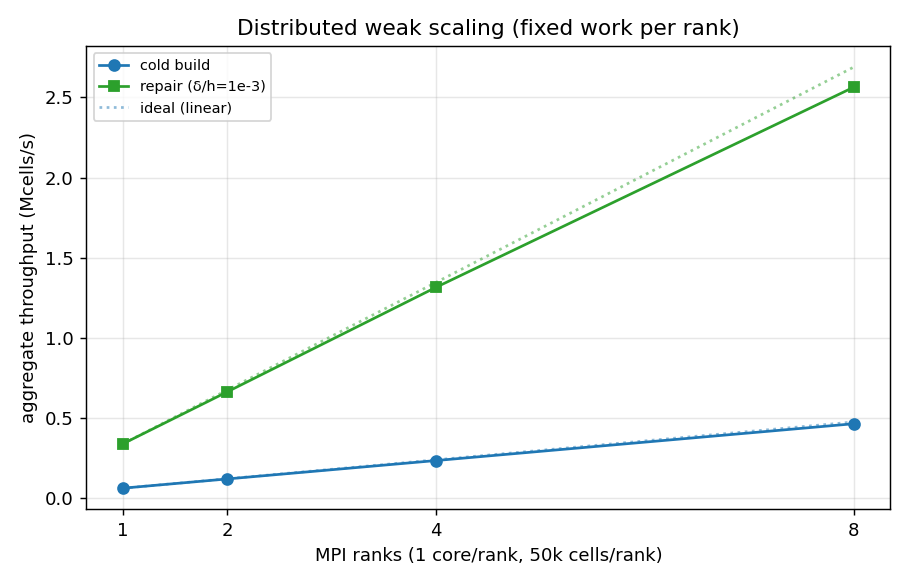
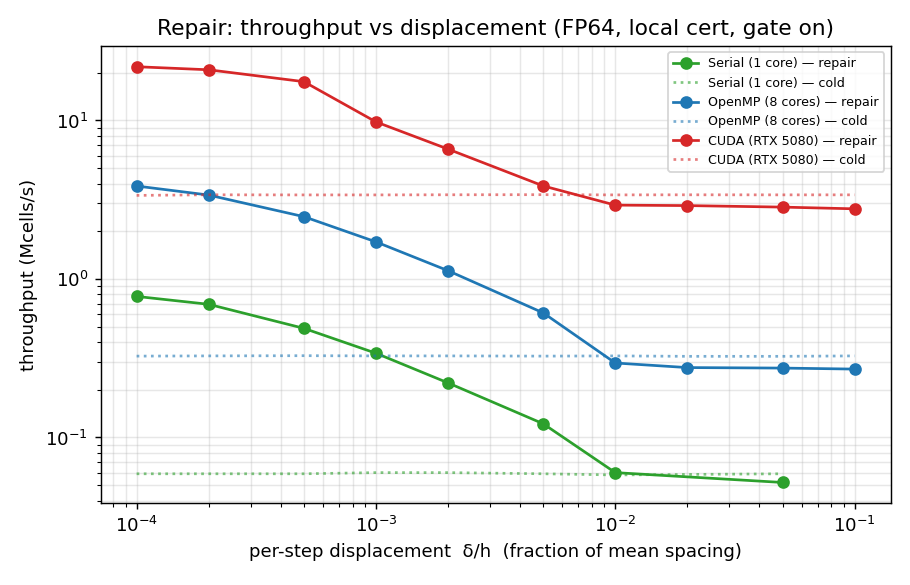
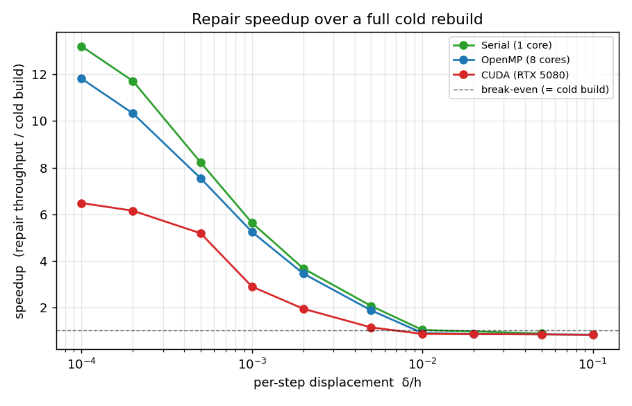
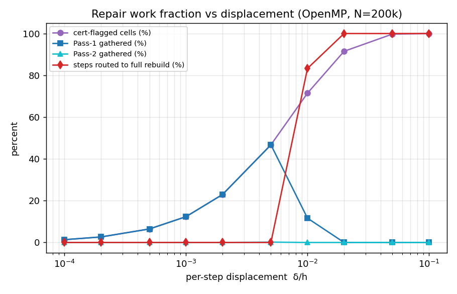
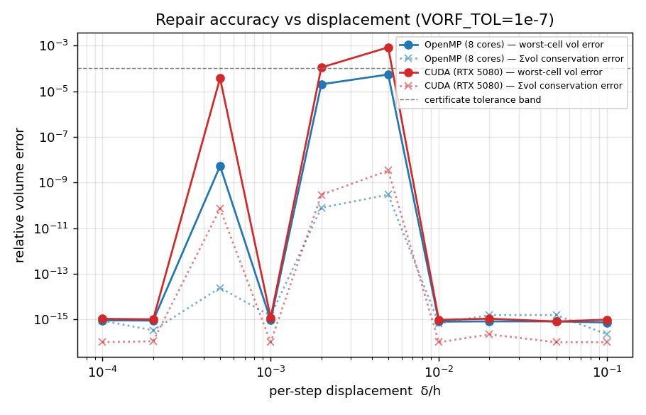

# vorflow moving-point Voronoi — performance, memory & accuracy report

**Scope.** This report measures the vorflow device tessellator on three execution backends and the
distributed (MPI) path, for two workloads:

1. **Cold build** — building the full Voronoi tessellation of a point set from scratch (the production
   CFD path, and the repair fallback/oracle), as a function of system size *N*, **with and without** the
   resident infrastructure the moving-point *repair* needs.
2. **Repair** — the moving-point per-step update (`MovingTessellation::step`), as a function of the
   per-step displacement δ/h (fraction of the mean inter-particle spacing), from tiny (almost nothing
   changes) to large (effectively a full rebuild).

Throughput is reported as **cells processed per second** (Mcells/s). We also report **memory**
footprint, **accuracy** (worst-cell volume error vs a fresh cold oracle, and the space-filling
Σvolume conservation), the **work fraction** the repair actually does (cells flagged / gathered /
rebuilt), and a short section on the cost of the **geometric computations**.

All numbers are FP64 unless noted. Reproduction commands are in the last section.

---

## 0. Setup

| | |
|---|---|
| CPU | 48-core x86-64 (Serial = 1 core, OpenMP = 8 cores unless noted) |
| GPU | NVIDIA GeForce RTX 5080 (Blackwell, `sm_120`), CUDA 13.2 |
| Backends | Kokkos Serial, OpenMP, CUDA; MPI via Open MPI 5.0.7 + transport-core ORB decomposition |
| Cell caps | `MAXP = 64` planes, `MAXT = 112` dual triangles |
| Distribution | uniform Poisson in a periodic unit box (the canonical, device-comparable reference) |
| Tolerance | repair certificate tolerance `VORF_TOL = 1e-7` (the accuracy-limiting knob) |

Driver: `tests/kokkos/bench_report.cpp` (CSV) for the sweeps, `tests/kokkos/bench_construct.cpp` for the
geometry tiers, `tests/kokkos_mpi/bench_repair_mpi.cpp` for the distributed path.

---

## 1. Implementations under test

### 1.1 Cold build (`buildTessellation`)

One thread per cell. Each cell is built in a compact **dual** representation (`ConvexCell`): a Voronoi
vertex is a *triple of plane indices*, the cell a small dual-triangle list that lives in registers /
a tiny per-thread frame (this is what lifts GPU occupancy far above the retired half-edge engine). The
build is two phases:

* **Gather** — a voro++-derived presorted *worklist* walks neighbour grid cells closest-first and stops
  at the security radius. This is the neighbour query; it is the dominant cost (see §2).
* **Construct + geometry** — `initBox → clip* → geometry`. Each plane is clipped on the fly
  (GEOGRAM/Ray-style convex-cell clip); geometry (volume + per-facet area, volume gradient dV, connector)
  is computed **sort-free and adjacency-free** by a per-vertex divergence-theorem scatter.

The cold build is the production CFD path. It optionally emits a compact resident **topology store**
(`np, nt, pnbr, packed triangles`) so a later step can re-evaluate/repair without re-gathering.

### 1.2 Repair (`MovingTessellation::step`)

Per step, following `docs/dynamic_update_decision_and_plan.md`:

1. Rebuild the per-step grid (cheap, memory-bound) and **re-evaluate every cell's geometry** on the new
   positions over its *stored* topology (no gather, no clip).
2. Run a **convexity certificate** over all cells. The cheap **Lawson local certificate**
   (`isLocallyConvex`) tests each dual vertex against four precomputed `poke4` planes (its three
   edge-opposite planes + the dual tet's fourth face); with the fourth face it **matches the brute
   certificate's flag set** (it is complete, not a subset). It also emits the *violated-plane partner
   seeds* (the gaining cells of a flip).
3. A **three-way gate** decides, from the free certificate signals: sparse → two-pass gather repair;
   high churn → fall straight to a full cold rebuild (the "never much slower than rebuild" guard).
4. **Two-pass gather** (the cold-build kernel restricted to an index list): Pass 1 = flagged ∪ partners
   ∪ skin-movers; Pass 2 = the movers' new neighbours. A scoped **verify** re-certifies the gathered
   cells; if still dirty, a bounded extra pass, else a full rebuild. Exact for separated events; exact
   in general via the verify + rebuild fallback.

### 1.3 The "repair infrastructure" (what the cold build pays extra to enable)

The moving-point path keeps, resident per cell: the topology store (`pnbr`, packed `tri`), the **`poke4`**
cert-plane set, `np/nt`, the published `vol`, a per-cell Verlet reference `xRef`, and a handful of
compaction scratch arrays. The build maintains an **edge adjacency** (`adj`) incrementally inside
`clip` (replacing the `findSharing` horizon scan) and derives `poke4` from it once per gather
(`computePoke4`, no `findSharing`). This is the axis benchmarked as *plain* vs *repair-ready* below.

---

## 2. Cold build — throughput, scaling, memory



Throughput (Mcells/s), uniform Poisson, FP64. *plain* = production build (topology + volume, no resident
store); *repair-ready* = also emits the topology store + `poke4` (`MovingTessellation::rebuild`).

| backend | N=20k | N=100k | N=200k | N=1M | N=2M | plain→repair-ready |
|---|---|---|---|---|---|---|
| **Serial** (1 core) | 0.059 | 0.059 | 0.059 | — | — | ~0.044 (−25%) |
| **OpenMP** (8 cores) | 0.336 | 0.323 | 0.328 | 0.331 | — | ~0.242 (−26%) |
| **CUDA** (RTX 5080) | — | 2.99 | 3.25 | 3.54 | 3.61 | 2.4–3.0 (−15 to −20%) |

Observations:

* **Throughput is flat in N** on each backend (the build is local + grid-bucketed; no N-scaling
  blow-up). The GPU *rises* with N (3.0 → 3.6 Mcells/s) as it saturates the device.
* **OpenMP is ~5.6× serial** on 8 cores (memory-latency-bound gather scales sub-linearly; this is the
  known cold-build characteristic). **CUDA is ~11× the 8-core CPU** and ~60× a single core.
* The **repair infrastructure costs 15–26%** of the cold build (emitting the store + deriving `poke4`).
  It is paid once per (re)build; the moving-point loop then amortises it over many cheap steps (§5).
* **The gather dominates.** Construct-from-cache (no gather, §4) runs at 8.5 Mcells/s on the GPU vs
  3.6 Mcells/s for the full build — i.e. the neighbour gather costs roughly as much as the entire
  construct + geometry. This is the single biggest cold-build lever (see §7).

**Memory.** The resident repair store is exactly **1260 bytes/cell** (FP64), independent of N:

| component | bytes/cell | note |
|---|---|---|
| `pnbr` (neighbour/plane id) | 256 | `MAXP·4` |
| `tri` (packed dual triangles) | 448 | `MAXT·4` |
| `poke4` (cert plane set) | 448 | `MAXT·4`, packed `unsigned char` |
| `np,nt` + `vol` + `xRef` | 40 | |
| compaction scratch | 68 | masks / worklists / partner-extra |
| **total** | **1260** | + transient grid & facet over-buffers (freed) |

For scale: 1 M cells = **1.26 GB** of resident store (FP64); 2 M cells fit comfortably in the RTX 5080's
16 GB alongside positions and the transient buffers. The `poke4` table is the same 4 bytes/triangle as
the retired "poke" store it replaces, so the complete Lawson cert is **memory-neutral**.

**Space-filling conservation.** Σ(cell volume)/box − 1 is **≤ 4×10⁻¹⁵** at every N on every backend
(`vol_err` column) — the build is volume-conservative to round-off.

### SOTA context

* The **neighbour gather** is a voro++-derived worklist; on a single core the cold build is at
  **voro++ parity** (≈1.0–1.05× voro++ on the same point sets — prior measurement,
  `vorflow-worklist-gather`).
* The **per-cell construct** (sort-free dual-triangle `ConvexCell`) is at GPU SOTA: ~14–17 Mcells/s FP32
  construct, which **beat the Liu-2020 GPU code on the same hardware** (prior measurement,
  `voronoi_build_plan`). The FP64 construct here is 8.5 Mcells/s (§4); FP32 is ~1.5–2× faster.
* The **full** cold build (3.6 Mcells/s GPU FP64) is therefore *gather-bound*, not construct-bound —
  consistent with both points above.

---

## 3. Distributed build (MPI: full-MPI and MPI+OpenMP)

The distributed path uses the transport-core ORB block decomposition + async ghost-layer exchange (NBX);
each rank cold-builds its owned cells (ghosts are cut candidates), and the moving-point step refreshes
ghost positions on the established halo topology, re-gathering only on a (global) skin trip.



**Weak scaling** — fixed **50 000 cells/rank**, δ/h=1e-3, 1 core/rank (per-step cold ms / repair ms,
and aggregate Mcells/s):

| ranks | N_global | cold ms | repair ms | cold Mcells/s | repair Mcells/s | parallel efficiency |
|---|---|---|---|---|---|---|
| 1 | 50k | 846 | 149 | 0.059 | 0.34 | 1.00 |
| 2 | 100k | 856 | 151 | 0.116 | 0.66 | 0.99 |
| 4 | 200k | 862 | 152 | 0.231 | 1.31 | 0.98 |
| 8 | 400k | 866 | 156 | 0.461 | **2.56** | 0.95 |

* **Near-ideal weak scaling.** Per-rank wall time is flat across np, so aggregate throughput scales
  **~linearly** — np=8 delivers **7.8× the cold-build and 7.6× the repair throughput** of one rank
  (95% efficiency). This is the regime MPI is for: problems larger than one node, with the per-rank
  domain big enough that the ghost surface is a small fraction of the volume.
* **Strong scaling** (fixed N_global) is, as expected, much weaker: splitting a *node-sized* problem
  adds a thick ghost layer per rank and a halo exchange while barely reducing per-rank work, so for a
  problem that already fits one node a single OpenMP/GPU build wins. Use ranks to grow the problem, not
  to subdivide a small one.
* **Correctness:** machine-exact vs a single-rank oracle at np = 1, 2, 4, 6, 8 and hybrid (np=4×OMP2);
  the repair's skin-trip re-gather path is exercised at the larger δ/h.
* **Hybrid MPI+OpenMP** composes (each rank runs the OpenMP build over its owned cells); pick the
  rank×thread split from the node topology.

> **Fixed during this study (was an np≥4 deadlock).** The per-step driver chose, *per rank*, between
> re-gather (rebuild the halo topology) and refresh (forward on it) — both **collective** with different
> NBX/Waitall patterns. When ranks diverged on the *local* skin-trip test at larger δ/h, they entered
> mismatched collectives and deadlocked (gdb showed half the ranks in `NbxEngine::exchange`, half in
> `forwardDirect/Waitall`). The fix is the distributed-Verlet invariant: reduce the skin trip to a
> **global** `MPI_Allreduce(MAX)` decision — if any rank trips, all re-gather. (Driver bug only; the
> halo collectives were correct.)

---

## 4. Geometric-computation timing

The geometry (cell volume + per-facet area vector, volume gradient dV, connector) is computed sort-free
and adjacency-free. `bench_construct` isolates the **construct-from-cache** path (candidate planes
cached, *no gather*) at three tiers: **G0** topology only (dual vertices are a free byproduct), **G1**
+ cell volume, **G2** + per-facet derivatives (area, dV, connector — the physics set).

| backend | G0 topology | G1 +volume | G2 +derivatives | volume cost | derivative cost |
|---|---|---|---|---|---|
| Serial | 118.0 kc/s | 111.0 | 100.3 | +6% | +15% (cum.) |
| OpenMP (8c) | 659.9 kc/s | 626.9 | 570.7 | +5% | +14% (cum.) |
| CUDA | 8520 kc/s | 8134 | 6812 | +5% | +20% (cum.) |

* **The geometry is cheap.** Adding the cell volume costs ~5%; adding the full per-facet derivative set
  (areas + dV + connector) costs ~14–20% on top of pure topology. The sort-free divergence-theorem
  scatter pays off — geometry is not the bottleneck.
* **Construct ≫ full build.** Note G0 here (8.5 Mcells/s GPU) is ~2.4× the *full* cold build
  (3.6 Mcells/s, §2): again, the **gather**, not the construct or the geometry, sets the cold-build rate.
* The moving-point **re-evaluation** step (`reevalGeometry`, geometry on a *fixed* topology, no clip)
  is cheaper still and is what makes the small-displacement repair fast (§5).

---

## 5. Repair — throughput vs displacement

Driver: `MovingTessellation::step` over a ballistic trajectory, local (Lawson) certificate, gate on,
`VORF_TOL=1e-7`. OpenMP N=200k, CUDA N=500k, Serial N=50k.




Speedup over a full cold rebuild (= repair throughput / cold-build throughput):

| δ/h | Serial | OpenMP | CUDA | regime |
|---|---|---|---|---|
| 1e-4 | **13.2×** | **11.8×** | **6.5×** | almost nothing changes (re-eval + cert only) |
| 2e-4 | 11.7× | 10.3× | 6.2× | |
| 5e-4 | 8.2× | 7.5× | 5.2× | |
| 1e-3 | 5.6× | 5.2× | 2.9× | a few % of cells flip |
| 2e-3 | 3.7× | 3.5× | 1.9× | |
| 5e-3 | 2.1× | 1.9× | 1.1× | ~half the cells flagged |
| 1e-2 | 1.0× | 0.90× | 0.86× | gate starts routing to rebuild |
| ≥2e-2 | 0.88× | 0.84× | 0.84× | gate → full rebuild (≈ cold + one re-eval) |

Absolute repair throughput peaks at **21.8 Mcells/s on the GPU** and **3.86 Mcells/s on 8 CPU cores**
(δ/h=1e-4).

* **Big wins in the small-displacement regime** real CFD/DEM time-stepping lives in (δ/h ≲ 2e-3):
  5–13× on CPU, 2–6× on GPU. The CPU speedup is larger because its cold build is comparatively
  expensive; on the GPU the cold build is already cheap, so the *ratio* is smaller even though the
  *absolute* repair rate is far higher.
* **Graceful degradation.** As δ/h grows the gate routes more steps to a full rebuild; past δ/h≈2e-2 the
  repair is a uniform **~0.85×** — one re-evaluation of overhead on top of the rebuild, never a blow-up.
  This is the "never much slower than rebuild" guarantee.

### Work fraction (what the repair actually touches)



OpenMP, N=200k. `flagged` = cells the certificate flags; `Pass-1`/`Pass-2` = cells gathered; `gate` =
steps routed to a full rebuild.

| δ/h | flagged % | Pass-1 gathered % | Pass-2 % | steps→rebuild % |
|---|---|---|---|---|
| 1e-4 | 1.3 | 1.3 | 0.0 | 0 |
| 1e-3 | 12.4 | 12.4 | 0.0 | 0 |
| 5e-3 | 46.7 | 46.7 | 0.17 | 0 |
| 1e-2 | 71.5 | 11.6 | 0.0 | 83 |
| 5e-2 | 99.7 | 0.0 | 0.0 | 100 |

* The flagged fraction tracks δ/h: ~1.3% at 1e-4, ~12% at 1e-3, ~half at 5e-3, →100% by 5e-2. **Pass-2
  is essentially zero** for smooth motion (it only fires for genuine insertions/teleports), confirming
  the two-pass design closes in effectively one pass.
* Once the flagged fraction is large (~70%+), the gate flips the whole step to a rebuild (cheaper than
  gathering most of the domain) — visible as Pass-1% collapsing while gate% → 100.

### Repair memory

Same **1260 bytes/cell** resident store as the repair-ready cold build (§2); the step adds only the
per-step grid and the transient gather over-buffers (freed each step). No per-step growth.

---

## 6. Accuracy & volume conservation



Two measures vs δ/h (VORF_TOL=1e-7): **worst-cell** relative volume error vs a fresh cold oracle, and
the **space-filling** Σvol/box−1.

* **Σvolume is conserved to round-off (≤ a few ×10⁻¹⁵) at every δ/h** — including the large-displacement
  cases. The gate routing large steps to a full (exact) rebuild is what guarantees this: **volume is
  never "lost"**, even when effectively everything moves.
* **Worst-cell error is machine-exact** (~10⁻¹⁵) in the gather-clean regime and again once the gate
  rebuilds. In the *local-repair band* (δ/h ≈ 5e-4 … 5e-3) a **handful of cells** (`missed`: 1–5 on CPU,
  up to ~23 on GPU at δ/h=5e-3) carry a sub-tolerance error up to ~5×10⁻⁵ (CPU) / ~8×10⁻⁴ (GPU). These
  are *marginal faces* whose area sits below the certificate tolerance; the GPU shows more of them
  because its FMA-fused arithmetic is not bit-identical to the host (a known, expected property — it is
  accurate, not bit-reproducible). They do not accumulate (each step re-evaluates from the resident
  topology and the verify + gate keep the global state exact), and they vanish at the small δ/h where
  CFD operates and at the large δ/h where the gate rebuilds.

Net: **fully volume-conservative everywhere; machine-exact except a few sub-tolerance marginal cells in
the moderate-displacement band**, which is the documented accuracy/speed trade-off of the local
certificate's tolerance.

---

## 7. Easy wins (discussion)

1. **Attack the gather — the cold-build bottleneck.** The construct runs at 8.5 Mcells/s (GPU, G0) but
   the full build at 3.6; the gather is ~60% of the cold build. Options: (a) a directional/BVH cull on
   the worklist (the 2026 arXiv:2605.06408 argues the missing ingredient is exactly a directional cull;
   a prior best-first BVH attempt without it didn't help); (b) reuse the per-step grid's neighbour lists
   across the *cold rebuild fallback* so a gated rebuild doesn't re-pay the full gather. Every Mcells/s
   on the gather lifts both the cold build and the rare repair-rebuild.
2. **Lean cert cell on GPU (occupancy) — TRIED, perf-neutral.** The certify/load/re-eval path now uses a
   `TrackAdj=false` cell with no `adj` member (the cert reads the `poke4` *store* pointer, not `adj`).
   It is the correct abstraction, but it gave **no measurable RTX 5080 speedup** (21.98 vs 21.8 Mcells/s
   at δ/h=1e-4): nvcc already dead-code-eliminates the never-read member, so it was not in the frame to
   begin with, and the certify is not occupancy-bound here. Kept for clarity; may still help on
   tighter-occupancy backends (HIP/older).
3. **FP32 cold/construct path.** FP32 construct is ~1.5–2× FP64 and hits the 14–17 Mcells/s SOTA; for
   workloads tolerant of FP32 topology (do the *certificate* in FP64 to avoid marginal-face flicker) the
   cold build and the repair gathers both speed up materially.
4. **Fuse the per-step grid build with the re-eval.** At small δ/h the step is dominated by the full-N
   re-eval + certificate + the (cheap) grid rebuild; fusing the grid bucketing into the re-eval pass
   would shave a memory-bound sweep. Modest, but it targets the exact small-δ/h floor where the biggest
   speedups live.
5. ~~Diagnose the np ≥ 4 MPI deadlock.~~ **Done** (§3) — it was a divergent-collective driver bug, fixed
   with a global skin-trip reduction; weak scaling is now ~linear to np=8. Next: a true multi-node run
   (this box is single-node) and dynamic load rebalancing for non-uniform densities.

---

## 8. Reproduce

```bash
cd vorflow
# build the CSV report bench on each backend prefix (serial / host-openmp / nvidia-cuda):
cmake --build build_<backend> --target bench_report bench_construct -j

# cold-build sweep (CSV: N,mcells_plain,mcells_repair,store_bytes_per_cell,vol_err):
VORF_NS="20000 100000 1000000" ./build_<backend>/tests/kokkos/bench_report --cold

# repair displacement sweep (CSV with throughput, work fraction, accuracy):
VORF_TOL=1e-7 ./build_<backend>/tests/kokkos/bench_report --repair <N> <nSteps>

# geometry tiers (G0/G1/G2 kcells/s, construct-from-cache):
./build_<backend>/tests/kokkos/bench_construct <N>

# distributed (each rank serial, or hybrid):
OMP_NUM_THREADS=<t> mpirun --bind-to none -np <r> \
  ./build_kmpi/bench_repair_mpi <N_global> <nSteps>

# figures (reads the CSVs): python3 scratch/plot_report.py
```

Data + figures backing this report: `docs/figs/report/*.png`. FP32 variants: append `_f32` to the
target and run identically.
